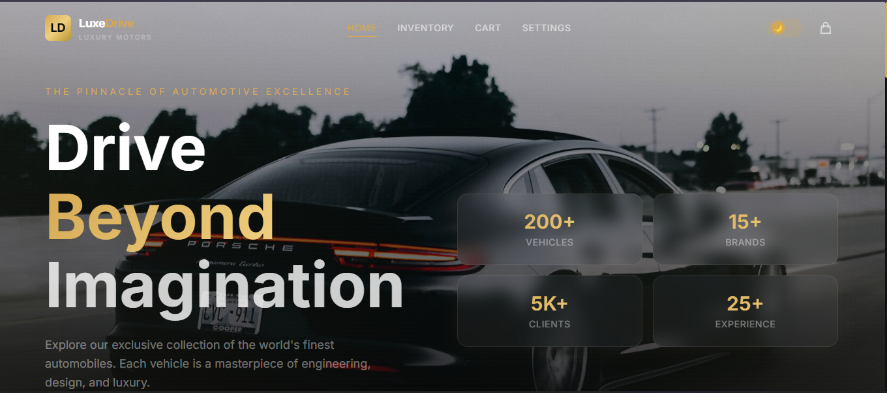
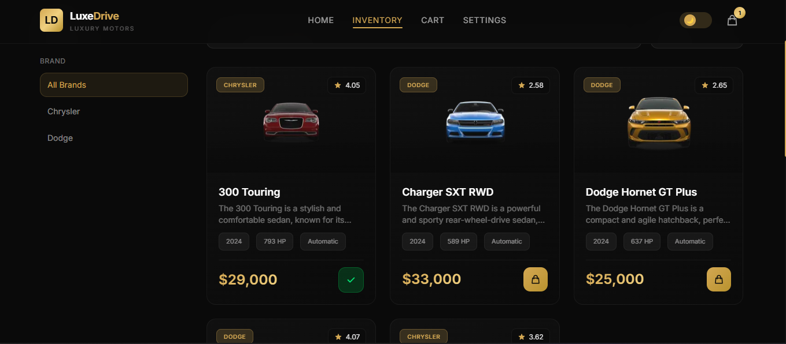
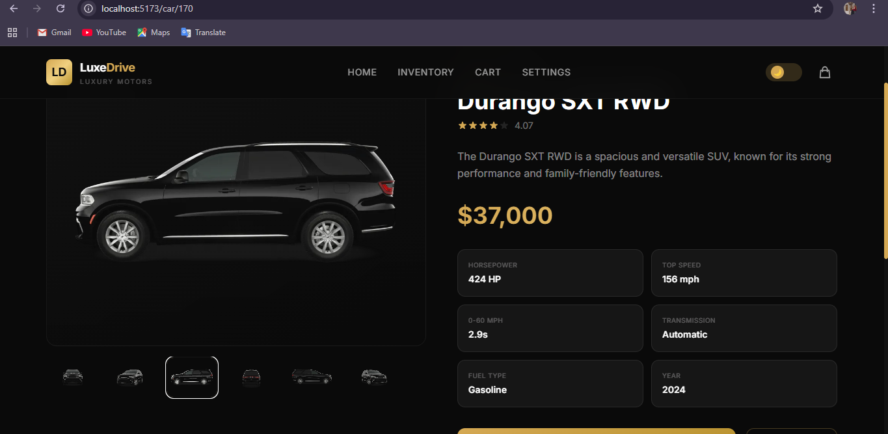
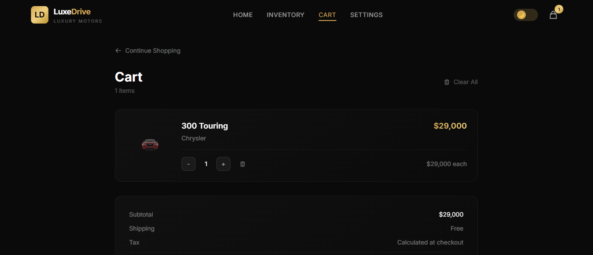
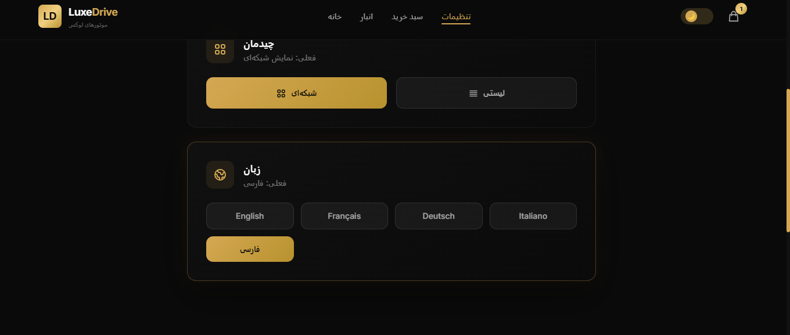
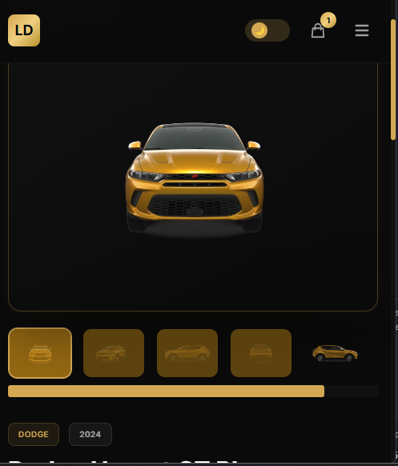

# 🏎️ LuxeDrive — Luxury Car Marketplace

> A cinematic, premium luxury car marketplace built with React. Features a futuristic dark UI with gold accents, glassmorphism cards, and smooth animations.


> 🔗 **Live Demo:** [https://luxe-drive-cyan.vercel.app/](YOUR_DEPLOYED_URL_HERE)

---

## ✨ Features

- **Cinematic Hero Section** — Full-screen hero with animated scroll indicator
- **Product Inventory** — Grid/list view with pagination, search, filter, and sort
- **Car Details** — Detailed specs, image gallery, and add-to-cart flow
- **Shopping Cart** — Slide-out drawer + full cart page with quantity controls
- **Settings Panel** — Theme toggle (dark/light), layout switch, language preference
- **Toast Notifications** — Animated success feedback on cart actions
- **Skeleton Loading** — Shimmer-based loading states for every view
- **Fully Responsive** — Mobile, tablet, and desktop optimized
- **LocalStorage Persistence** — Cart and settings survive page reloads
- **API + Fallback** — Fetches from DummyJSON; falls back to local dataset
- **404 Page** — Custom not-found with animated illustration
- **Lazy Loading** — Route-based code splitting for optimal performance

---

## 🛠️ Tech Stack

| Technology | Purpose |
|------------|---------|
| **React 19** + **Vite 8** | Frontend framework & build tool |
| **Tailwind CSS 4** | Utility-first styling with custom theme |
| **React Router DOM 7** | Client-side routing |
| **Redux Toolkit** | Global cart state management |
| **React Query (TanStack 5)** | Server state, caching, pagination |
| **Context API + useReducer** | UI settings (theme, layout, language) |
| **Axios** | HTTP client for API calls |
| **Framer Motion** | Page transitions, stagger, hover animations |
| **React Icons** | Icon library (Heroicons v2) |

---

## 📸 Screenshots

| Page | Preview |
|------|---------|
| **Home** |  |
| **Inventory** |  |
| **Car Details** |  |
| **Cart** |  |
| **Settings** |  |
| **Mobile** |  |

---

## 🏗️ Architecture

### State Management Strategy (3 Layers)

```
┌─────────────────────────────────────────────┐
│          Context API + useReducer           │
│         (UI Settings - Theme/Layout)        │
├─────────────────────────────────────────────┤
│              Redux Toolkit                   │
│           (Global Cart State)               │
├─────────────────────────────────────────────┤
│              React Query                     │
│         (Server State - Cars API)           │
└─────────────────────────────────────────────┘
```

### 1️⃣ Context API + useReducer — UI Settings

Used **exclusively** for UI preferences. No business logic.

- **Theme**: Dark/Light mode toggle
- **Layout**: Grid or List view for inventory
- **Language**: English / French / German / Italian

Persisted to `localStorage` with automatic save on every dispatch.

```jsx
// src/context/settingsReducer.js
const settingsReducer = (state, action) => {
  switch (action.type) {
    case 'TOGGLE_THEME':
      return { ...state, theme: state.theme === 'dark' ? 'light' : 'dark' };
    case 'SET_LAYOUT':
      return { ...state, layout: action.payload };
    case 'SET_LANGUAGE':
      return { ...state, language: action.payload };
  }
};
```

### 2️⃣ Redux Toolkit — Cart State

Used **exclusively** for the shopping cart — true global business state.

Actions: `addToCart`, `removeFromCart`, `increaseQuantity`, `decreaseQuantity`, `clearCart`

Selectors: `selectCartItems`, `selectCartTotalQuantity`, `selectCartTotalPrice`

```jsx
const cartSlice = createSlice({
  name: 'cart',
  initialState: { items: [] },
  reducers: { /* ... */ },
});
```

### 3️⃣ React Query — Server State

Used **exclusively** for API data fetching, caching, and pagination.

- `useCars(page)` — paginated vehicle list
- `useCarById(id)` — single vehicle details
- `useSearchCars(query, page)` — search results

```jsx
export const useCars = (page = 1, limit = 12) => {
  return useQuery({
    queryKey: ['cars', page],
    queryFn: () => fetchCars({ skip: (page - 1) * limit, limit }),
    staleTime: 5 * 60 * 1000,
  });
};
```

---

## 🚀 Installation

```bash
# Clone the repository
git clone https://github.com/yourusername/luxedrive.git
cd luxedrive

# Install dependencies
npm install

# Start development server
npm run dev

# Build for production
npm run build

# Preview production build
npm run preview
```

---

## 🎨 Design System

| Token | Value |
|-------|-------|
| Background | `#0a0a0a` (Luxury Black) |
| Gold Accent | `#d4a853` |
| Glass Effect | `rgba(255,255,255,0.03)` + `backdrop-filter: blur(20px)` |
| Font | Inter (sans) + Playfair Display (display) |
| Card Style | Glassmorphism with golden hover glow |
| Border Radius | `16px` (cards), `12px` (inputs/buttons) |

---

## 🌐 API

Primary: `https://dummyjson.com/products/category/vehicle`

Fallback: Local dataset of 12 luxury cars in `src/data/luxuryCars.js`

Includes: Lamborghini, Ferrari, Porsche, Rolls Royce, Tesla, BMW, Mercedes, Audi, McLaren, Bentley, Aston Martin, Bugatti.

---

## 📄 License

MIT
